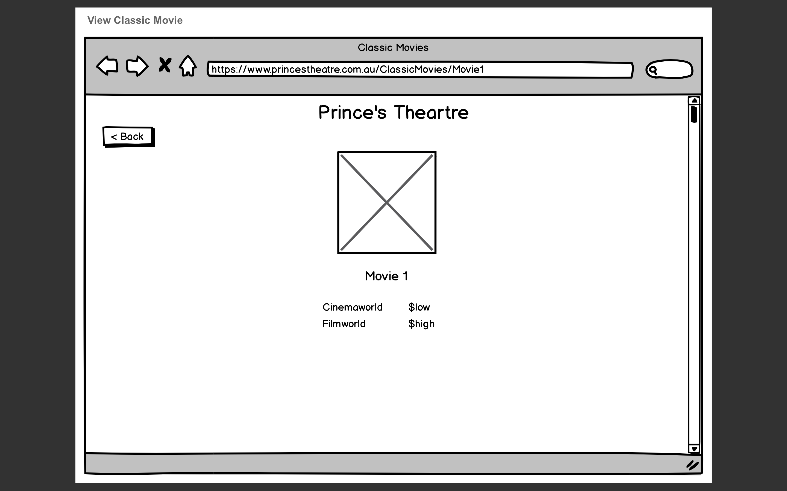
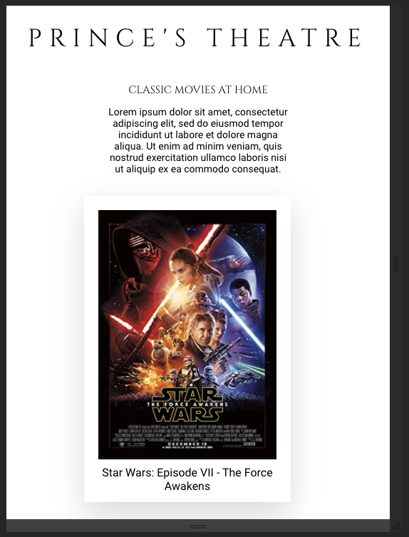

# Prince's Theatre

### Lexicon Digital Challenge

## Instructions

#### Command line inputs:

`npm start` - runs application  
`npm test` - runs test suite  
`npm run cypress` - loads cypress test  
`npm run` compile:sass - compiles sass into css file  

#### As a user:

As a user of Prince's Theatre brand new price comparison website/application you'll begin on the homepage where you will see a list of all the available titles. When you click on one of these titles you will be taken to a new page that displays that individual film title with extra information such as it's plot, title and mainly all the streaming services that are currently offering this film and their prices, the cheapest price will always be displayed clearly to you in green however the application will also display the more expensive option(s) to you in red. If you'd like the select a different movie from Prince's Theaters list you can do so by clicking the back button in the top left corner.

# Assumptions, Decisions and Trade-offs

At the beginning of the application given the time restraints given, I decided to go for a front-end answer to this challenge as it's where I feel the most comfortable and have spent the most of my time coding recently. I know there are some pretty awesome options that could be possible with a backend such as accessing the Lexicon API through my own database, which could make it more stable as well as potentially easier to structure. As I said however this like a daunting undertaking given the time and my experience, so I would instead handle this complexity in the front-end.  

One of my first decisions came when I was building the application using hooks, looking back with my completed challenge I do believe it just an incorrect call but I was receiving too many CORS errors and losing time when I already had functionality with componentDidMount, so I decided to go with what I had functioning at the time, given more time I would go back to hooks as it's something I've been working with and I think functional components look cleaner overall and - obviously doing my best to stay up to date with the newer React features.  

Early on in the challenge I was not using Redux, just ReactJS by itself, and although at the time it was working fine the further I dived into my solution the more complicated I saw it becoming and quickly switched to using Redux which cleaned up my code as well as set me up for the rest of the challenge.  

Once I was able to fetch data from all 4 of the API's my next decision was how was this all going to work? Looking at the movies API's I could see the only two parameters that were the same was the ID and the Title this would be how I would make a call to each to match the prices of Cinema World and Film World. I felt as though using the Title would probably be more consistent for right now but I was concerned about the future as well as how much longer/more complex a Title is than an ID. For this reason I decided to match the ID, I did this by using slice to remove the `fw` or `cw` off the front of the ID and passed it to my fetch of the movie API's.  

At this point of building my application I was receiving and displaying all the data I needed but the errors were really an issue and I had to make a decision on how I would handle them.  
My first thought was retrying my fetch calls if they were to return an error, initially I had some issues and some over complex answers on how I would achieve this (Thanks Stack Overflow) and I benched the idea for a time while I decided to handle most of the issue in another way which later on would double as another safety net for my data this was to call both API's together and if one was to fail I would just show the data from the api that didn't fail, this isn't perfect I would still display no data if both API's failed, and if only one failed I'd only have one price however as I said it works great as a safety net. What began as a simple idea become far more complex that I initially planned as I needed to move the loading state deeper into the state so I could wait for the responses from each fetch request. This problem plagued me for so long I managed to fix my initial issue in the mean time by creating a simple iteration loop which would allow my fetch calls to run 3 extra times before returning fail error, I could increase this but after spending this much time with the API's I assumed that it was near impossible that this would occur and if it did, our other error handling can step in for the user.  

Finally - testing, I really wanted to check all the boxes with testing, it's one of the most important aspects of development. While studying it was unfortunately something that I didn't get to dive into too much, which I've quickly realized is something I need top push myself to improve at. First I decided to do some basic manual testing which I also got one of my room-mates to complete, I did this because it's always nice to receive feedback from someone who doesn't know the edge cases that will break your app and gives you a different perspective. Secondly I wanted to ensure that I tested the entire application end-to-end so I completed Cypress tests on each page and component, which is a nice way to ensure everything is displaying as intended and the fetch requests are returning the data you expected. And then for unit testing arguably the testing I have the least experience with I decided to use Enzyme as it's a library I'm more-comfortable with than React-Testing-Library right now (I'm working on it!) where I tested the requests passed through the reducer.  

To briefly touch on styling I wanted to stay true to the provided wireframes and keep it minimal and clean with some really basic animations for a better user experience, I chose to use SaSS because it's something new that I have been learning and I find when working on new projects or challenges it's the best time to push yourself using a new skill. I have also spent a lot of time recently using Styled/Emotion which might have been a cleaner option.  

Throughout all of these decisions I had to make a lot of assumptions about many different aspects of the application and how they would impact the 'final' product both on submission and moving forward if more was to be added. Throughout the process I always kept in my mind, "What is next?". What if I needed to implement another API, what if the data was different, what if one of the apis was to be taken offline, what would happen when the user presses this button, can this code be broken down to ensure it's as simple for the next person to read etc.  

What if.. I had 6 days? Given more time there are a few adjustments I'd like to make to the current state of the application, firstly we're only fetching the data of all of the movies displayed on the landing page from a single API this is pretty safe due to the retries but incurs other risks, what if the API I'm not fetching was to update with more movies are we're only calling that data from a single place? What if we were to add a third API and it had ..movies other than Star Wars?! What a catastrophe! I also think once anymore movies are added a search function is essential as well as reducing the amount thats displayed on the home screen using flex-box right now they will just continue on forever, I'd like to cut it to 8 or so. I'd also like to spend some more time on Unit tests, but I felt as I'd see more immediate value using Cypress than snapshoting each component.

# Context and Tech

- npm
- ReactJS / Redux / Thunk
- React-router-dom
- Node-Sass (SaSS)
- Enzyme
- Cypress

I've touched on most of this above I believe but to quickly summarize, I chose React as it's a front-end library I have the most experience with, I believed it would give me the best results and I enjoy working with it. Redux allowed me to easily handle the data of the application as well as the errors from the API. I used Thunk over Saga for simplicity I didn't feel I needed to use anything from Saga at this point in time. React-router-dom was used to handle routing and links. I used SaSS for styling as a bit of a challenge as well as keeping my code cleaner with variables and ampersands (I used Node-Sass to compile). Enzyme for unit testing as it's the testing library I have the most experience with and Cypress to ensure I was testing the whole application.

# Architectural Elements

This is hard to answer without having a back-end where I feel like a majority of my architectural decisions would have happened. However, I decided to build this application using React-Redux to give myself a consistent state throughout the application after I fetched the data from the API's. I thought this would be best given the inconsistencies of the API's it made the errors easier to track and handle.  
Some of the architectural decisions I did need to make were around how I would handle the data after I fetched it, as I said above I decided to slice off the front of the ID from the movies API, once I did this I needed to pass the ID to both of the movie API's to return the data from both. Then I needed to decide how my reducer would handle this. A reducer is just a function so I used combineReducers to turn my single reducer into two separate reducers using a provider to separate filmWorld from cinemaWorld and then lodge a loading state as well as the data within them allowing me to effectively handle the data, load state and errors within my application.

# Testing

#### Manual User Tests

[Google Doc Spreadsheet](https://docs.google.com/spreadsheets/d/1VGfZZ31y37obhbV6seKrDADwnWQBhOqRbx4VobPhbbA/edit?usp=sharing)

#### Screenshot Test Features

#### Screenshot Test Cases

## Wireframes & Screenshots

Provided Wireframes and screenshots of the final result

### Movie List Page

#### Wireframe

#### Screenshot

### Movie Comparison Page

#### Wireframe

#### Screenshot

### Responsive Screenshots

Responsiveness is important, especially in this day and age where we have so many varying screen sizes and many more users on phones and tablets than ever before. For your website / application to be successful it is essential that it's able to be used the same as it would be on a home desktop. Although I did not with this application many people consider designing for mobile first to be the way of the future.

#### Movie List Page

#### Movie Comparison Page

### Axe Accessability Addon Results

The Axe addon is an easy to use browser addon that you can use to easily check your application for WCAG 2 and Section 508 accessibility.

